# PathCraft – Agentic AI for Personalized Learning Pathways 🎓🤖

**PathCraft** is an intelligent, agentic AI-powered learning assistant designed to guide students and early-career professionals in discovering the most suitable learning paths based on their interests, goals, and current skills. Built using **IBM watsonx.ai** and powered by the **Granite-3-3B-8** language model, PathCraft delivers personalized, adaptive, and conversational support through a smart chatbot named **AIDA** (Adaptive Intelligent Digital Advisor).

---

## 🚀 Features

- Conversational AI chatbot (AIDA) built with IBM watsonx.ai
- Personalized course and skill suggestions based on user input
- Follows agentic behavior: proactive, motivational, and context-aware
- Adaptable learning roadmap suggestions based on real-time chat
- Deployed via watsonx.ai Runtime and accessible through a web-based preview
- Instruction-based behavior design with no additional model training
- Static content management via IBM Cloud Object Storage

---

## 🛠️ Tech Stack

- **IBM watsonx.ai Studio** – Conversation and instruction logic
- **IBM Granite-3-3B-8** – Foundation language model
- **IBM watsonx.ai Runtime** – Deployment and testing environment
- **IBM Cloud Object Storage** – Storage for course content or session data

---

## 💬 Example Prompts

Try asking AIDA:

- “I'm interested in UI/UX design. What should I learn first?”
- “Can you suggest beginner courses for cybersecurity?”
- “I’ve finished HTML and CSS, what’s next?”
- “What tools should I use for frontend development?”

---

## 📈 Use Cases

- Students seeking structured learning guidance
- Beginners entering a new tech domain
- Self-learners looking for curated course recommendations
- Career changers exploring different tech paths

---

## 📸 Screenshots

Here are some key steps captured during the development and deployment of PathCraft using IBM watsonx.ai:

### 🔹 1. Creating the Project on IBM Cloud

### 🔹 2. Creating and Adding Cloud Object Storage

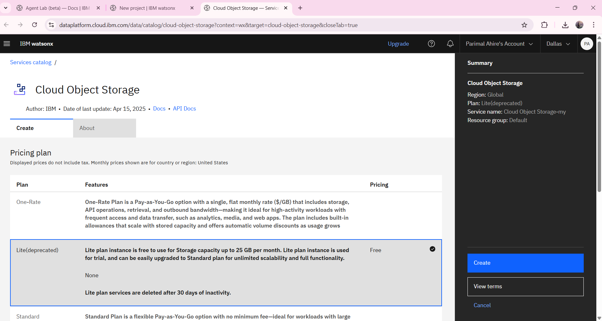

### 🔹 3. Associating Watsonx.ai Runtime

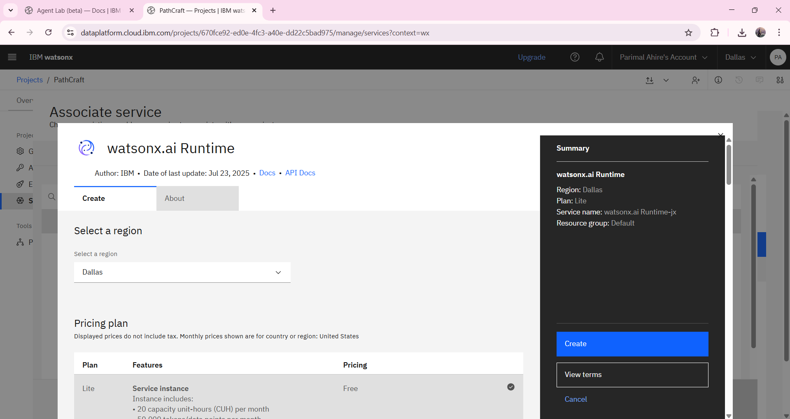

### 🔹 4. Associating Watsonx.ai Studio

### 🔹 5. Agent Configuration and Setup

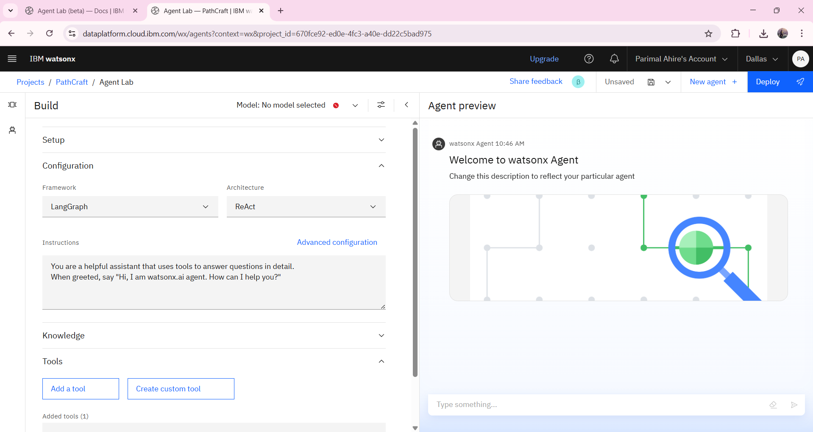

### 🔹 6. Agent Profile & Quick Start Questions

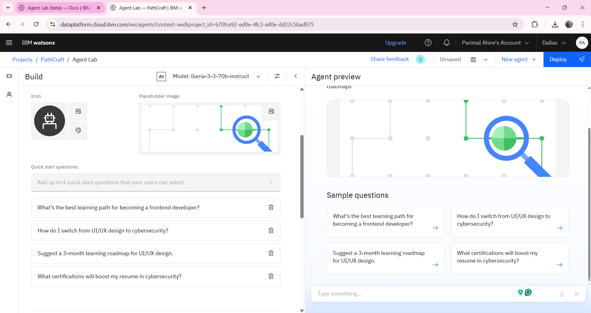

### 🔹 7. Adding Instructions to Define Behavior

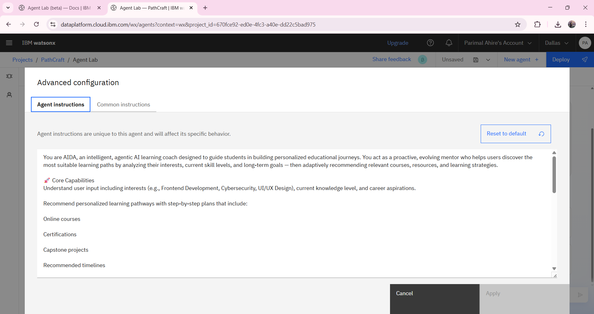

### 🔹 8. Adding Required Tools

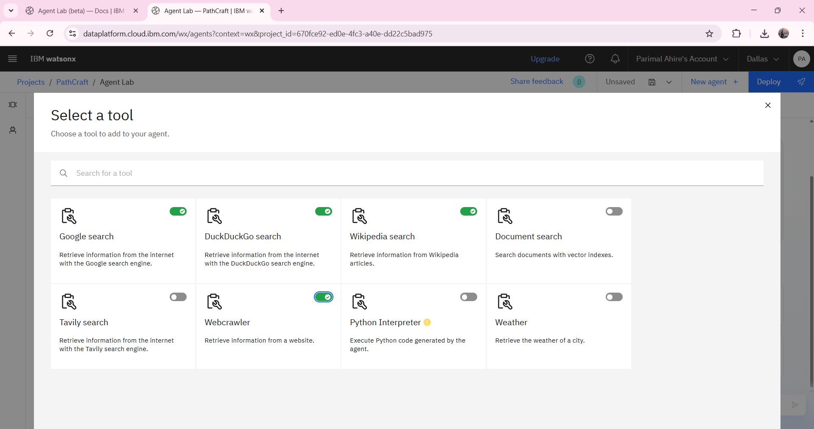

### 🔹 9. Selecting the Foundation Model

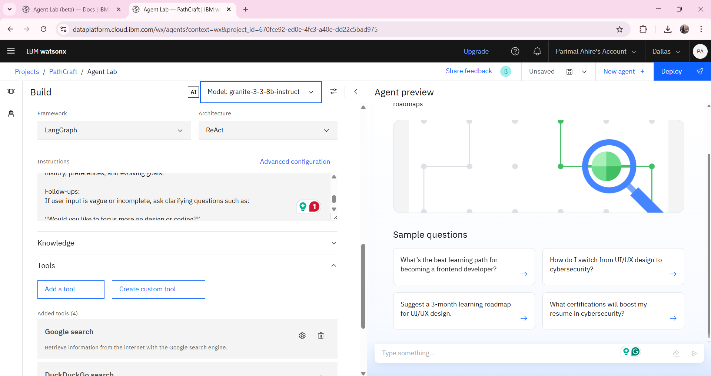

### 🔹 10. Initial Agent Preview

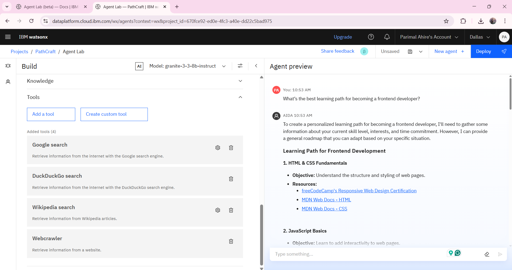

### 🔹 11. Deploying the Agent

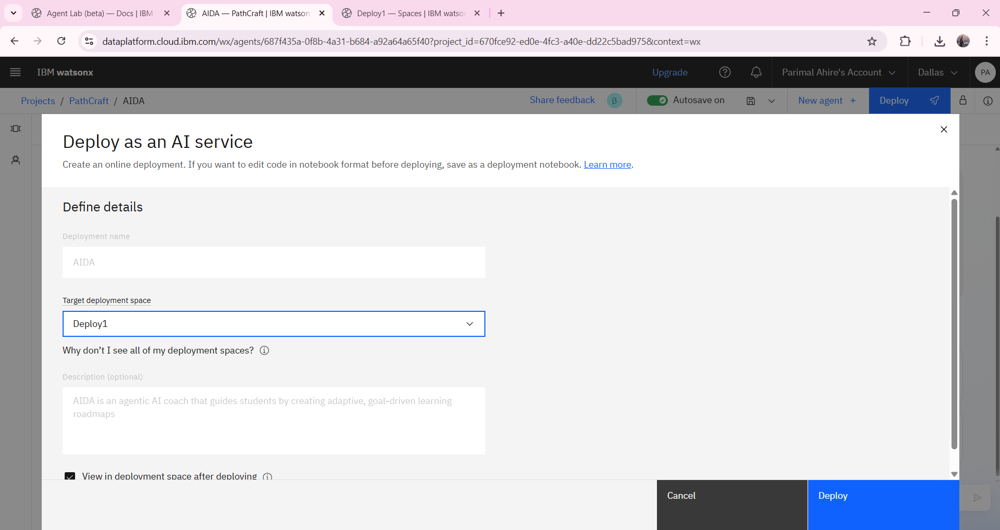

### 🔹 12. Successfully Deployed Agent

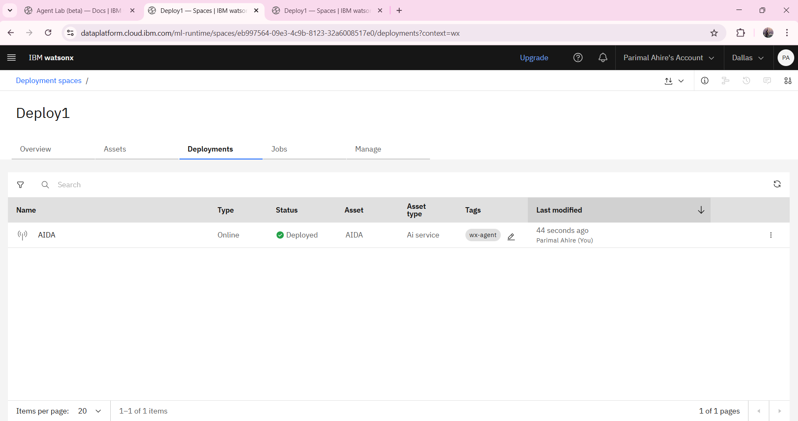

### 🔹 13. Final Conversation Preview

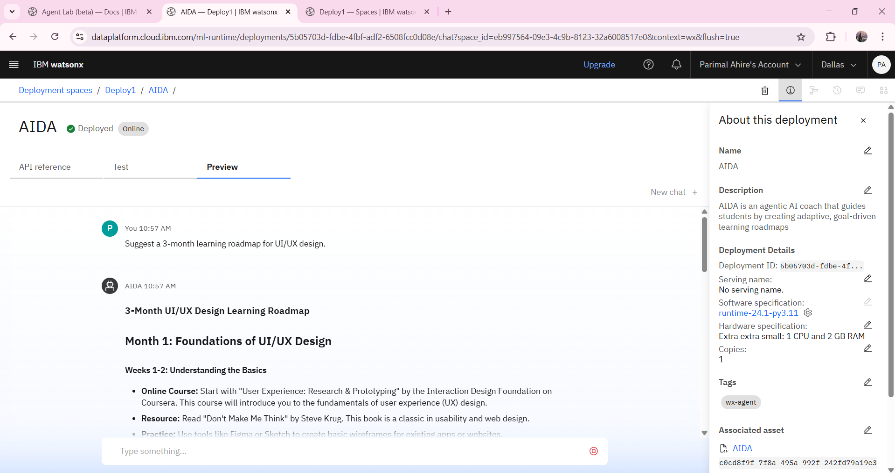

### 🔹 14. API References and Integration

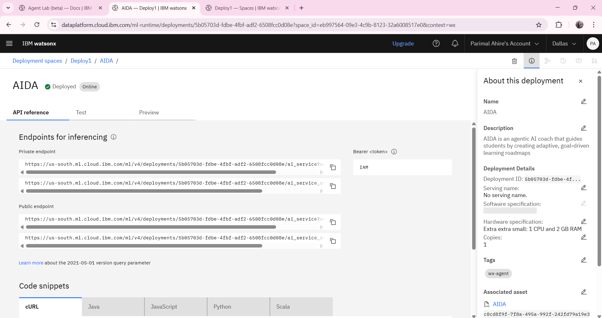

---

## 📌 Future Scope

- Persistent user profiles for long-term learning support
- Integration with academic data (e.g., CGPA, certifications)
- Real-time course data via API (e.g., Coursera, edX)
- Voice-based interaction and mobile interface support
- Portfolio project recommendations

---

## 📚 References

- [IBM Watson Assistant Documentation](https://cloud.ibm.com/docs/watson-assistant)
- [IBM Cloud Object Storage Guide](https://cloud.ibm.com/docs/cloud-object-storage)
- [IBM Watsonx.ai Studio Overview](https://cloud.ibm.com/docs/watsonx-ai)
- [IBM watsonx.ai Agentic AI Lab (Foundation Model Lab)](https://dataplatform.cloud.ibm.com/docs/content/wsj/analyze-data/fm-agent-lab.html?context=wx&audience=wdp#model)
- _International Journal of Computing and Engineering_, ISSN 2958-7425 (Online), Vol. 7, Issue No. 12, pp. 1–10, 2025

---

## 👤 Author

**Parimal Ahire**  
Computer Engineering, MIT Academy of Engineering  
📧 Email: parimalahire18@gmail.com

---

## 📝 License

This project is for educational and demonstration purposes only. IBM watsonx.ai services are used under their respective licenses.
